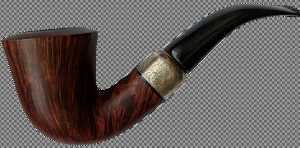
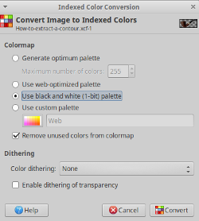
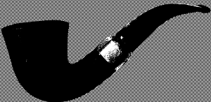
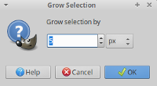
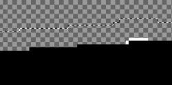
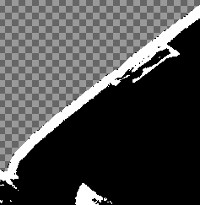
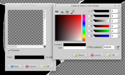

# How to extract a contour from an object?

## 1. Reduce colors to only  black and white

Image -> Mode -> Indexed ...

Select 'Use black and white (1-bit) palette.

Click 'OK'.

## 2. Create a border around the object

Select outside the object with the 'Fuzzy Select Tool'.

Select -> Invert.

Select -> Grow.

Select how thick the contour should be.

## 3. Color the contour white with the 'Bucket Fill'

## 4. Remove the black color

Switch the image's mode from 'Indexed' back to 'RGB'.

Image -> Mode -> RGB.

Replace the black color with transparency (alpha).

Color -> Color to alpha.

