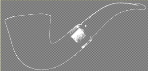
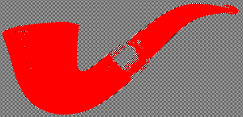

# How to extract a filling from a contour?

## 1. Fill the outer segment black with the 'Bucket Fill'.

## 2. Fill the transparent part

Layer -> Transparency -> Alpha to selection.

Select -> Invert.

Fill it red with the 'Bucket Fill'.

## 3. Copy the red part to a new image

The alpha selection is still active.

Copy it with Ctrl + C.

Create a new image with Ctrl + N. Select a transparent background.

Paste it with Ctrl + V.

