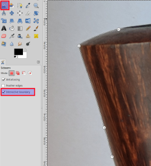
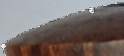
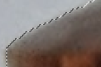
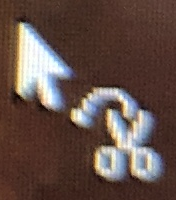
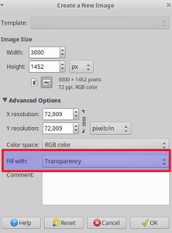

# How to extract an object from a picture?

## 1. Select using the scissors

> To make the selection easier, select the "Interactive boundary", which will draw the path while dragging.

> Warning! It's a very picky tool. 
> * Is precise only on images with a high quality.
> * No "Undo", no history. 
> * You'll need to do it from the start, if You mess it up - change tool, select outside.
> * Get's laggy, if has too many points selected.
> * You can't change the position of the first and the last point.

Draw the line across the borders, till You can link the first and the last point.

When the points are linked, hover the cursor over the selection. It should display an icon with a circle above the scissors.

Click on the selection, only if the mentoned icon appears, otherwise check if the first and the last points are linked.
Points will disappear and the the regular selection will appear and the cursor will change.

### If you mess up with points

Take the points before the last (You can not move the last one), and move them back. Try to straighten them out.

## 2. Move the selection to a new image

Copy with Ctrl + C.

Create a new image with Ctrl + N. Click on the 'Advanced Options' and select 'Transparency' in the "Fill with'. Click 'OK'.

Paste with Ctrl + V.

